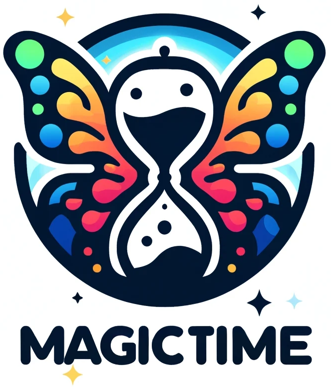

<div align=center>

</div>
<h2 align="center"> <a href="https://arxiv.org/abs/2404.05014">MagicTime: Time-lapse Video Generation Models 
  
<a href="https://arxiv.org/abs/2404.05014">as Metamorphic Simulators</a></h2>
<h5 align="center"> If you like our project, please give us a star ⭐ on GitHub for the latest update.  </h2>

<h5 align="center">


[](https://huggingface.co/spaces/BestWishYsh/MagicTime?logs=build)
[](https://replicate.com/camenduru/magictime)
[](https://colab.research.google.com/github/camenduru/MagicTime-jupyter/blob/main/MagicTime_jupyter.ipynb)
[](https://huggingface.co/papers/2404.05014)
[](https://arxiv.org/abs/2404.05014) 
[](https://pku-yuangroup.github.io/MagicTime/) 
[](https://drive.google.com/drive/folders/1WsomdkmSp3ql3ImcNsmzFuSQ9Qukuyr8?usp=sharing)
[](https://twitter.com/_akhaliq/status/1777538468043792473)
[](https://twitter.com/vhjf36495872/status/1777525817087553827?s=61&t=r2HzCsU2AnJKbR8yKSprKw)
[](https://zenodo.org/doi/10.5281/zenodo.10960665)
[](https://github.com/PKU-YuanGroup/MagicTime/blob/main/LICENSE) 


</h5>

<div align="center">
This repository is the official implementation of MagicTime, a metamorphic video generation pipeline based on the given prompts. The main idea is to enhance the capacity of video generation models to accurately depict the real world through our proposed methods and dataset.
</div>


<br>
<details open><summary>💡 We also have other video generation project that may interest you ✨. </summary><p>
<!--  may -->


> [**Open-Sora-Plan**](https://github.com/PKU-YuanGroup/Open-Sora-Plan) <br>
> PKU-Yuan Lab and Tuzhan AI etc. <br>
> [](https://github.com/PKU-YuanGroup/Open-Sora-Plan)  [](https://github.com/PKU-YuanGroup/Open-Sora-Plan)  <br>
</p></details>

 
## 📣 News
* ⏳⏳⏳ Training a stronger model with the support of [Open-Sora-Plan](https://github.com/PKU-YuanGroup/Open-Sora-Plan) (e.g 257 x 512 × 512).
* ⏳⏳⏳ Release the training code of MagicTime.
* `[2024.04.14]`  Thanks [@camenduru](https://twitter.com/camenduru) and [@ModelsLab](https://modelslab.com/) for providing [Jupyter Notebook](https://github.com/camenduru/MagicTime-jupyter) and [Replicate Demo](https://replicate.com/camenduru/magictime).
* `[2024.04.13]`  🔥 We have compressed the size of repo with less than 1.0 MB, so that everyone can clone easier and faster. You can click [here](https://github.com/PKU-YuanGroup/MagicTime/archive/refs/heads/main.zip) to download, or use `git clone --depth=1` command to obtain this repo.
* `[2024.04.12]`  Thanks [@Jukka Seppänen](https://github.com/kijai) and [@Baobao Wang](https://www.bilibili.com/video/BV1wx421U7Gn/?spm_id_from=333.1007.top_right_bar_window_history.content.click) for providing ComfyUI Extension [ComfyUI-MagicTimeWrapper](https://github.com/kijai/ComfyUI-MagicTimeWrapper). If you find related work, please let us know. 
* `[2024.04.11]`  🔥 We release the Hugging Face Space of MagicTime, you can [click](https://huggingface.co/spaces/BestWishYsh/MagicTime?logs=build) here to have a try.
* `[2024.04.10]`  🔥 We release the inference code and model weight of MagicTime.
* `[2024.04.09]`  🔥 We release the arXiv paper for MagicTime, and you can click [here](https://arxiv.org/abs/2404.05014) to see more details.
* `[2024.04.08]`  🔥 We released the subset of ChronoMagic dataset used to train MagicTime. The dataset includes 2,265 metamorphic video-text pairs and can be downloaded at [Google Drive](https://drive.google.com/drive/folders/1WsomdkmSp3ql3ImcNsmzFuSQ9Qukuyr8?usp=sharing).
* `[2024.04.08]`  🔥 **All codes & datasets** are coming soon! Stay tuned 👀!

## 😮 Highlights

MagicTime shows excellent performance in **metamorphic video generation**.

### Metamorphic Videos vs. General Videos 

Compared to general videos, metamorphic videos contain physical knowledge, long persistence, and strong variation, making them difficult to generate. We show compressed .gif on github, which loses some quality. The general videos are generated by the [Animatediff](https://github.com/guoyww/AnimateDiff) and **MagicTime**.

<table>
  <tr>
    <td colspan="1"><center>Type</center></td>  
    <td colspan="1"><center>"Bean sprouts grow and mature from seeds"</center></td>
    <td colspan="1"><center>"[...] construction in a Minecraft virtual environment"</center></td>
    <td colspan="1"><center>"Cupcakes baking in an oven [...]"</center></td>
    <td colspan="1"><center>"[...] transitioning from a tightly closed bud to a fully bloomed state [...]"</center></td>
  </tr>
  <tr>
    <td>General Videos</td>  
    <td></td>
    <td></td>
    <td></td>
    <td></td>
  </tr>
  <tr>
    <td>Metamorphic Videos</td>  
    <td></td>
    <td></td>
    <td></td>
    <td></td>
  </tr>
</table>

### Gallery

We showcase some metamorphic videos generated by **MagicTime**, [MakeLongVideo](https://github.com/xuduo35/MakeLongVideo), [ModelScopeT2V](https://github.com/modelscope), [VideoCrafter](https://github.com/AILab-CVC/VideoCrafter?tab=readme-ov-file), [ZeroScope](https://huggingface.co/cerspense/zeroscope_v2_576w), [LaVie](https://github.com/Vchitect/LaVie), [T2V-Zero](https://github.com/Picsart-AI-Research/Text2Video-Zero), [Latte](https://github.com/Vchitect/Latte) and [Animatediff](https://github.com/guoyww/AnimateDiff) below.

<table>
  <tr>
    <td colspan="1"><center>Method</center></td>  
    <td colspan="1"><center>"cherry blossoms transitioning [...]"</center></td>
    <td colspan="1"><center>"dough balls baking process [...]"</center></td>
    <td colspan="1"><center>"an ice cube is melting [...]"</center></td>
    <td colspan="1"><center>"a simple modern house's construction [...]"</center></td>
  </tr>
  <tr>
    <td>MakeLongVideo</td>  
    <td></td>
    <td></td>
    <td></td>
    <td></td>
  </tr>
  <tr>
    <td>ModelScopeT2V</td>  
    <td></td>
    <td></td>
    <td></td>
    <td></td>
  </tr>
  <tr>
    <td>VideoCrafter</td>  
    <td></td>
    <td></td>
    <td></td>
    <td></td>
  </tr>
  <tr>
    <td>ZeroScope</td>  
    <td></td>
    <td></td>
    <td></td>
    <td></td>
  </tr>
  <tr>
    <td>LaVie</td>  
    <td></td>
    <td></td>
    <td></td>
    <td></td>
  </tr>
  <tr>
    <td>T2V-Zero</td> 
    <td></td>
    <td></td>
    <td></td>
    <td></td>
  </tr>
  <tr>
    <td>Latte</td>
    <td></td>
    <td></td>
    <td></td>
    <td></td>
  </tr>
  <tr>
    <td>Animatediff</td>
    <td></td>
    <td></td>
    <td></td>
    <td></td>
  </tr>
  <tr>
    <td>Ours</td>  
    <td></td>
    <td></td>
    <td></td>
    <td></td>
  </tr>
</table>


We show more metamorphic videos generated by **MagicTime** with the help of [Realistic](https://civitai.com/models/4201/realistic-vision-v20), [ToonYou](https://civitai.com/models/30240/toonyou) and [RcnzCartoon](https://civitai.com/models/66347/rcnz-cartoon-3d).

<table>
  <tr>
    <td></td>
    <td></td>
    <td></td>
  </tr>
  <tr>
    <td colspan="1"><center>"[...] bean sprouts grow and mature from seeds"</center></td>
    <td colspan="1"><center>"dough [...] swells and browns in the oven [...]"</center></td>
    <td colspan="1"><center>"the construction [...] in Minecraft [...]"</center></td>
  </tr>
  <tr>
    <td></td>
    <td></td>
    <td></td>
  </tr>
  <tr>
    <td colspan="1"><center>"a bud transforms into a yellow flower"</center></td>
    <td colspan="1"><center>"time-lapse of a plant germinating [...]"</center></td>
    <td colspan="1"><center>"[...] a modern house being constructed in Minecraft [...]"</center></td>
  </tr>
  <tr>
    <td></td>
    <td></td>
    <td></td>
  </tr>
  <tr>
    <td colspan="1"><center>"an ice cube is melting"</center></td>
    <td colspan="1"><center>"bean plant sprouts grow and mature from the soil"</center></td>
    <td colspan="1"><center>"time-lapse of delicate pink plum blossoms [...]"</center></td>
  </tr>
</table>

Prompts are trimmed for display, see [here](https://github.com/PKU-YuanGroup/MagicTime/blob/main/__assets__/promtp_unet.txt) for full prompts.
### Integrate into DiT-based Architecture

The mission of this project is to help reproduce Sora and provide high-quality video-text data and data annotation pipelines, to support [Open-Sora-Plan](https://github.com/PKU-YuanGroup/Open-Sora-Plan) or other DiT-based T2V models. To this end, we take an initial step to integrate our MagicTime scheme into the DiT-based Framework. Specifically, our method supports the Open-Sora-Plan v1.0.0 for fine-tuning. We first scale up with additional metamorphic landscape time-lapse videos in the same annotation framework to get the ChronoMagic-Landscape dataset. Then, we fine-tune the Open-Sora-Plan v1.0.0 with the ChronoMagic-Landscape dataset to get the MagicTime-DiT model. The results are as follows (**257×512×512 (10s)**):

<table>
  <tr>
    <td></td>
    <td></td>
    <td></td>
    <td></td>
  </tr>
  <tr>
    <td colspan="1"><center>"Time-lapse of a coastal landscape [...]"</center></td>
    <td colspan="1"><center>"Display the serene beauty of twilight [...]"</center></td>
    <td colspan="1"><center>"Sunrise Splendor: Capture the breathtaking moment [...]"</center></td>
    <td colspan="1"><center>"Nightfall Elegance: Embrace the tranquil beauty [...]"</center></td>
  </tr>
    <td></td>
    <td></td>
    <td></td>
    <td></td>
  </tr>
  <tr>
    <td colspan="1"><center>"The sun descending below the horizon [...]"</center></td>
    <td colspan="1"><center>"[...] daylight fades into the embrace of the night [...]"</center></td>
    <td colspan="1"><center>"Time-lapse of the dynamic formations of clouds [...]"</center></td>
    <td colspan="1"><center>"Capture the dynamic formations of clouds [...]"</center></td>
  </tr>
</table>

Prompts are trimmed for display, see [here](https://github.com/PKU-YuanGroup/MagicTime/blob/main/__assets__/promtp_opensora.txt) for full prompts.

## 🤗 Demo

### Gradio Web UI

Highly recommend trying out our web demo by the following command, which incorporates all features currently supported by MagicTime. We also provide [online demo](https://huggingface.co/spaces/BestWishYsh/MagicTime?logs=build) in Hugging Face Spaces.

```bash
python app.py
```

### CLI Inference

```bash
# For Realistic
python inference_magictime.py --config sample_configs/RealisticVision.yaml --human

# or you can directly run the .sh
sh inference_cli.sh
```

warning: It is worth noting that even if we use the same seed and prompt but we change a machine, the results will be different.

## ⚙️ Requirements and Installation

We recommend the requirements as follows.

### Environment

```bash
git clone --depth=1 https://github.com/PKU-YuanGroup/MagicTime.git
cd MagicTime
conda create -n magictime python=3.10.13
conda activate magictime
pip install -r requirements.txt
```

### Download Base Model and Dreambooth

```bash
sh prepare_weights/down_base_model.sh
sh prepare_weights/down_dreambooth.sh
```

### Prepare MagicTime Module

```bash
sh prepare_weights/down_magictime_module.sh
```

## 🗝️ Training & Inference

The training code is coming soon! For inference, some example are shown below:

```bash
# For Realistic
python inference_magictime.py --config sample_configs/RealisticVision.yaml
# For ToonYou
python inference_magictime.py --config sample_configs/ToonYou.yaml
# For RcnzCartoon
python inference_magictime.py --config sample_configs/RcnzCartoon.yaml
# or you can directly run the .sh
sh inference.sh
```

## Community Contributions

We found some plugins created by community developers. Thanks for their efforts: 

  - ComfyUI Extension [ComfyUI-MagicTimeWrapper](https://github.com/kijai/ComfyUI-MagicTimeWrapper) (by [@Jukka Seppänen](https://github.com/kijai)). And you can click [here](https://www.bilibili.com/video/BV1wx421U7Gn/?spm_id_from=333.1007.top_right_bar_window_history.content.click) to view the installation tutorial.
  - Replicate Demo & Cloud API [Replicate-MagicTime](https://replicate.com/camenduru/magictime) (by [@camenduru](https://twitter.com/camenduru)).
  - Jupyter Notebook [Jupyter-MagicTime](https://github.com/camenduru/MagicTime-jupyter) (by [@ModelsLab](https://modelslab.com/)).

If you find related work, please let us know. 

## 🐳 ChronoMagic Dataset
ChronoMagic with 2265 metamorphic time-lapse videos, each accompanied by a detailed caption. We released the subset of ChronoMagic used to train MagicTime. The dataset can be downloaded at [Google Drive](https://drive.google.com/drive/folders/1WsomdkmSp3ql3ImcNsmzFuSQ9Qukuyr8?usp=sharing). Some samples can be found on our Project Page.

## 👍 Acknowledgement
* [Animatediff](https://github.com/guoyww/AnimateDiff/tree/main) The codebase we built upon and it is a strong U-Net-based text-to-video generation model.

* [Open-Sora-Plan](https://github.com/PKU-YuanGroup/Open-Sora-Plan) The codebase we built upon and it is a simple and scalable DiT-based text-to-video generation repo, to reproduce [Sora](https://openai.com/sora).

## 🔒 License
* The majority of this project is released under the Apache 2.0 license as found in the [LICENSE](https://github.com/PKU-YuanGroup/MagicTime/blob/main/LICENSE) file.
* The service is a research preview. Please contact us if you find any potential violations.

## ✏️ Citation
If you find our paper and code useful in your research, please consider giving a star :star: and citation :pencil:.

```BibTeX
@article{yuan2024magictime,
  title={MagicTime: Time-lapse Video Generation Models as Metamorphic Simulators},
  author={Yuan, Shenghai and Huang, Jinfa and Shi, Yujun and Xu, Yongqi and Zhu, Ruijie and Lin, Bin and Cheng, Xinhua and Yuan, Li and Luo, Jiebo},
  journal={arXiv preprint arXiv:2404.05014},
  year={2024}
}
```

## 🤝 Contributors
<a href="https://github.com/PKU-YuanGroup/MagicTime/graphs/contributors">
  
  
</a>

