<h2 align="center"> <a href="https://github.com/PKU-YuanGroup/MagicTime">MagicTime: Time-lapse Video Generation Models 
  
<a href="https://github.com/PKU-YuanGroup/MagicTime">as Metamorphic Simulators</a></h2>
<h5 align="center"> If you like our project, please give us a star ⭐ on GitHub for the latest update.  </h2>

<h5 align="center">


  
[](https://github.com/PKU-YuanGroup/MagicTime) 
[](https://pku-yuangroup.github.io/MagicTime/) 
[](https://drive.google.com/drive/folders/1WsomdkmSp3ql3ImcNsmzFuSQ9Qukuyr8?usp=sharing)
[](https://github.com/PKU-YuanGroup/MagicTime/blob/main/LICENSE) 


</h5>

<div align="center">
This repository is the official implementation of MagicTime, a metamorphic video generation pipeline based on the given prompts. The main idea is to enhance the capacity of video generation models to accurately depict the real world through our proposed methods and dataset.
</div>

## 📣 News
* ⏳⏳⏳ Training a stronger model with the support of [Open-Sora-Plan](https://github.com/PKU-YuanGroup/Open-Sora-Plan) (e.g 257 x 512 × 512)..
* ⏳⏳⏳ The inference code and model weight of MagicTime will be released within a week.
* **[2024.04.08]**  🔥 We released the subset of ChronoMagic dataset used to train MagicTime. The dataset includes 2,265 metamorphic video-text pairs and can be downloaded at [Google Drive](https://drive.google.com/drive/folders/1WsomdkmSp3ql3ImcNsmzFuSQ9Qukuyr8?usp=sharing).
* **[2024.04.08]**  🔥 **All codes & datasets** are coming soon! Stay tuned 👀!

## 😮 Highlights

MagicTime shows excellent performance in **metamorphic video generation**.

### Metamorphic Videos vs. General Videos 

Compared to general videos, metamorphic videos contain physical knowledge, long persistence, and strong variation, making them difficult to generate. We show compressed .gif on github, which loses some quality. The general videos are generated by the [Animatediff](https://github.com/guoyww/AnimateDiff) and **MagicTime**.

<table>
  <tr>
    <td colspan="1"><center>Type</center></td>  
    <td colspan="1"><center>"Bean sprouts grow and mature from seeds"</center></td>
    <td colspan="1"><center>"[...] construction in a Minecraft virtual environment"</center></td>
    <td colspan="1"><center>"Cupcakes baking in an oven [...]"</center></td>
    <td colspan="1"><center>"[...] transitioning from a tightly closed bud to a fully bloomed state [...]"</center></td>
  </tr>
  <tr>
    <td>General Videos</td>  
    <td></td>
    <td></td>
    <td></td>
    <td></td>
  </tr>
  <tr>
    <td>Metamorphic Videos</td>  
    <td></td>
    <td></td>
    <td></td>
    <td></td>
  </tr>
</table>

### Gallery

We showcase some metamorphic videos generated by **MagicTime**, [MakeLongVideo](https://github.com/xuduo35/MakeLongVideo), [ModelScopeT2V](https://github.com/modelscope), [VideoCrafter](https://github.com/AILab-CVC/VideoCrafter?tab=readme-ov-file), [ZeroScope](https://huggingface.co/cerspense/zeroscope_v2_576w), [LaVie](https://github.com/Vchitect/LaVie), [T2V-Zero](https://github.com/Picsart-AI-Research/Text2Video-Zero), [Latte](https://github.com/Vchitect/Latte) and [Animatediff](https://github.com/guoyww/AnimateDiff) below.

<table>
  <tr>
    <td colspan="1"><center>Method</center></td>  
    <td colspan="1"><center>"cherry blossoms transitioning [...]"</center></td>
    <td colspan="1"><center>"dough balls baking process [...]"</center></td>
    <td colspan="1"><center>"an ice cube is melting [...]"</center></td>
    <td colspan="1"><center>"a simple modern house's construction [...]"</center></td>
  </tr>
  <tr>
    <td>MakeLongVideo</td>  
    <td></td>
    <td></td>
    <td></td>
    <td></td>
  </tr>
  <tr>
    <td>ModelScopeT2V</td>  
    <td></td>
    <td></td>
    <td></td>
    <td>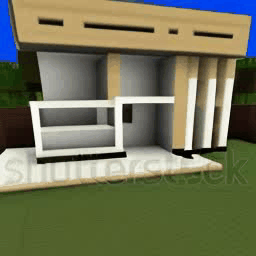</td>
  </tr>
  <tr>
    <td>VideoCrafter</td>  
    <td>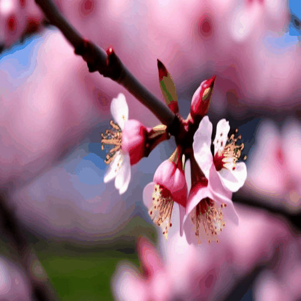</td>
    <td></td>
    <td></td>
    <td>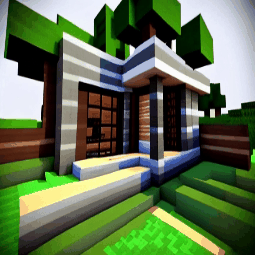</td>
  </tr>
  <tr>
    <td>ZeroScope</td>  
    <td></td>
    <td></td>
    <td></td>
    <td>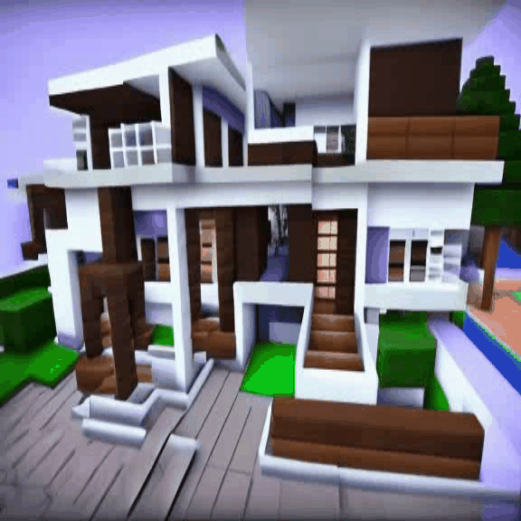</td>
  </tr>
  <tr>
    <td>LaVie</td>  
    <td>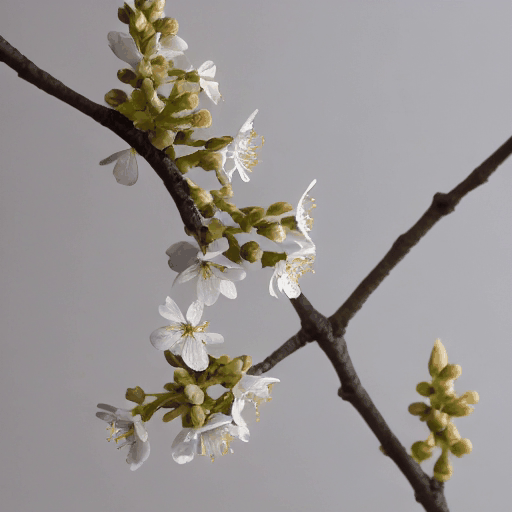</td>
    <td></td>
    <td></td>
    <td>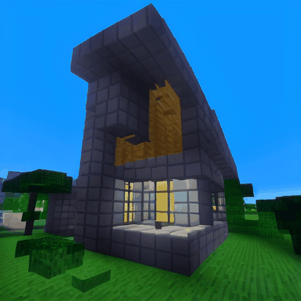</td>
  </tr>
  <tr>
    <td>T2V-Zero</td> 
    <td>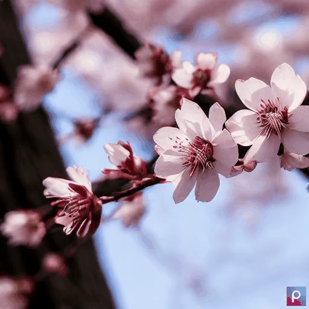</td>
    <td>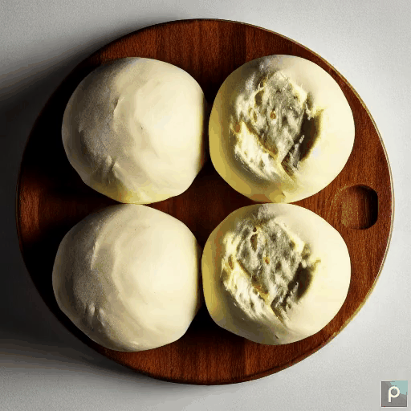</td>
    <td></td>
    <td>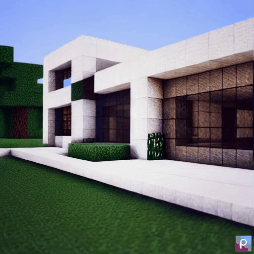</td>
  </tr>
  <tr>
    <td>Latte</td>
    <td></td>
    <td></td>
    <td>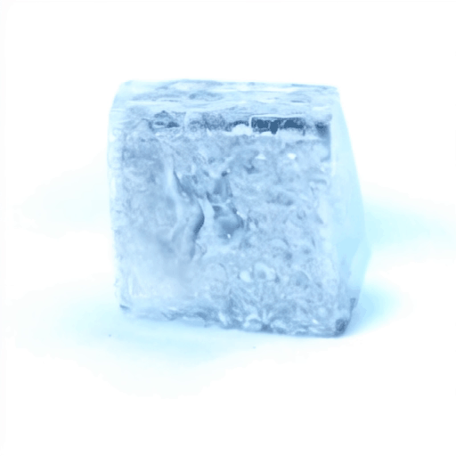</td>
    <td>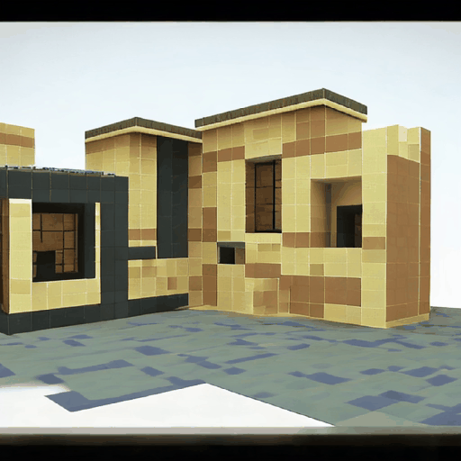</td>
  </tr>
  <tr>
    <td>Animatediff</td>
    <td>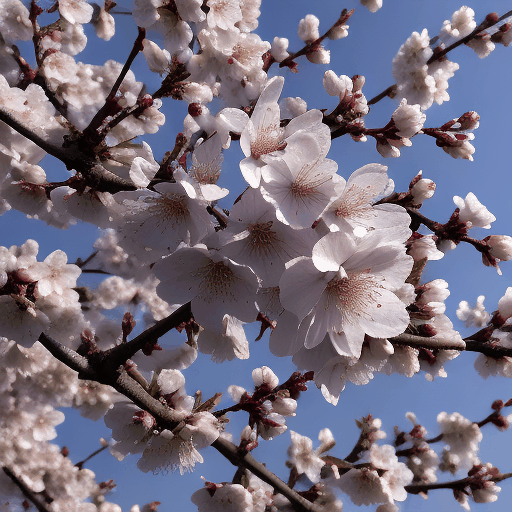</td>
    <td></td>
    <td>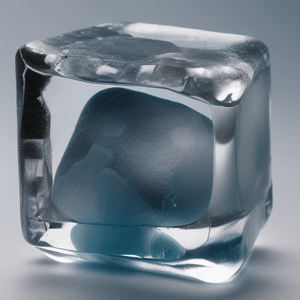</td>
    <td>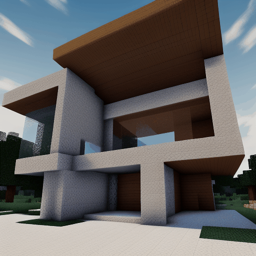</td>
  </tr>
  <tr>
    <td>Ours</td>  
    <td>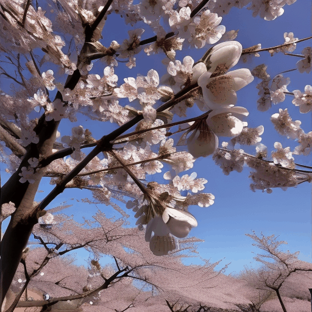</td>
    <td></td>
    <td></td>
    <td></td>
  </tr>
</table>


We show more metamorphic videos generated by **MagicTime** with the help of [Realistic](https://civitai.com/models/4201/realistic-vision-v20), [ToonYou](https://civitai.com/models/30240/toonyou) and [RcnzCartoon](https://civitai.com/models/66347/rcnz-cartoon-3d), 

<table>
  <tr>
    <td>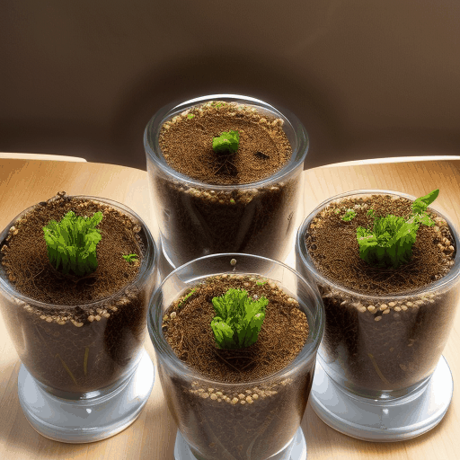</td>
    <td>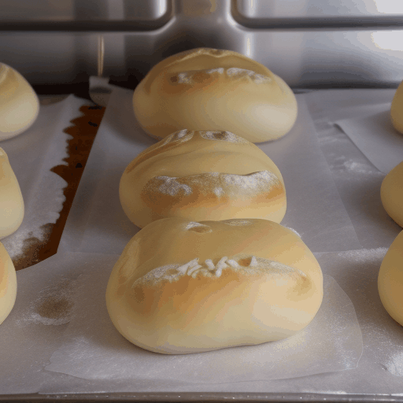</td>
    <td>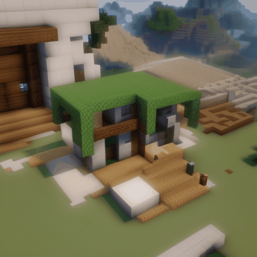</td>
  </tr>
  <tr>
    <td colspan="1"><center>"[...] bean sprouts grow and mature from seeds"</center></td>
    <td colspan="1"><center>"dough [...] swells and browns in the oven [...]"</center></td>
    <td colspan="1"><center>"the construction [...] in Minecraft [...]"</center></td>
  </tr>
  <tr>
    <td>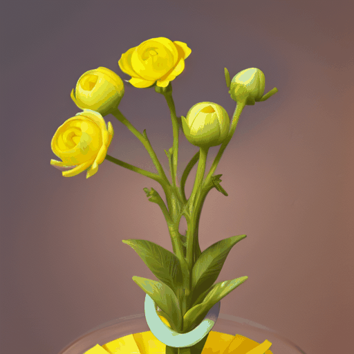</td>
    <td>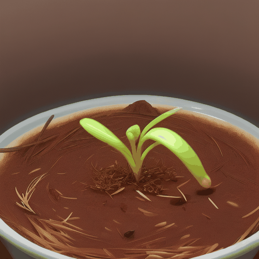</td>
    <td>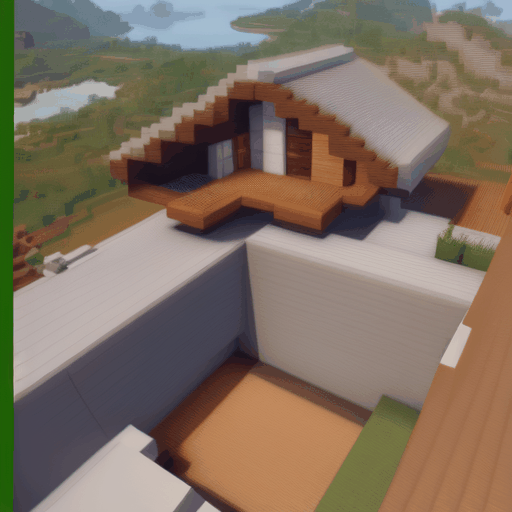</td>
  </tr>
  <tr>
    <td colspan="1"><center>"a bud transforms into a yellow flower"</center></td>
    <td colspan="1"><center>"time-lapse of a plant germinating [...]"</center></td>
    <td colspan="1"><center>"[...] a modern house being constructed in Minecraft [...]"</center></td>
  </tr>
  <tr>
    <td>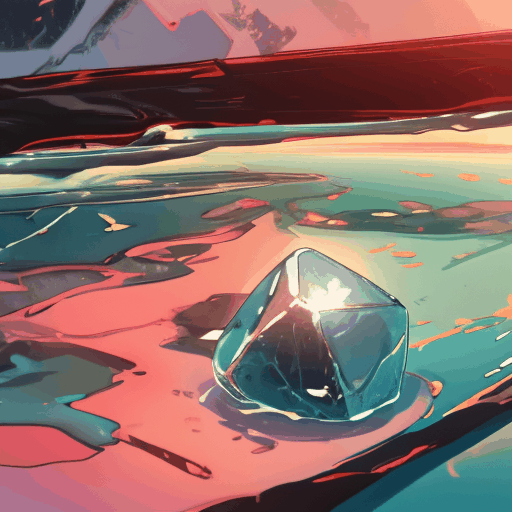</td>
    <td>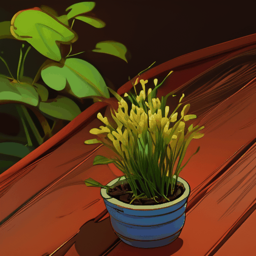</td>
    <td>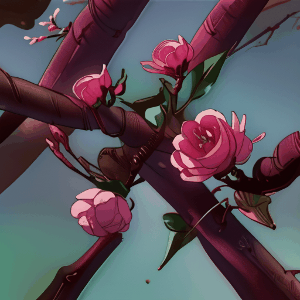</td>
  </tr>
  <tr>
    <td colspan="1"><center>"an ice cube is melting"</center></td>
    <td colspan="1"><center>"bean plant sprouts grow and mature from the soil"</center></td>
    <td colspan="1"><center>"time-lapse of delicate pink plum blossoms [...]"</center></td>
  </tr>
</table>

### Integrate into DiT-based Architecture

The mission of this project is to help reproduce Sora and provide high-quality video-text data and data annotation pipelines, to support [Open-Sora-Plan](https://github.com/PKU-YuanGroup/Open-Sora-Plan) or other DiT-based T2V models. To this end, we take an initial step to integrate our MagicTime scheme into the DiT-based Framework. Specifically, our method supports the Open-Sora-Plan v1.0.0 for fine-tuning. We first scale up with additional metamorphic landscape time-lapse videos in the same annotation framework to get the ChronoMagic-Landscape dataset. Then, we fine-tune the Open-Sora-Plan v1.0.0 with the ChronoMagic-Landscape dataset to get the MagicTime-DiT model. The results are as follows (**257×512×512 (10s)**):

<table>
  <tr>
    <td></td>
    <td></td>
    <td></td>
    <td></td>
  </tr>
  <tr>
    <td colspan="1"><center>"Time-lapse of a coastal landscape [...]"</center></td>
    <td colspan="1"><center>"Display the serene beauty of twilight [...]"</center></td>
    <td colspan="1"><center>"Sunrise Splendor: Capture the breathtaking moment [...]"</center></td>
    <td colspan="1"><center>"Nightfall Elegance: Embrace the tranquil beauty [...]"</center></td>
  </tr>
    <td></td>
    <td></td>
    <td></td>
    <td></td>
  </tr>
  <tr>
    <td colspan="1"><center>"The sun descending below the horizon [...]"</center></td>
    <td colspan="1"><center>"[...] daylight fades into the embrace of the night [...]"</center></td>
    <td colspan="1"><center>"Time-lapse of the dynamic formations of clouds [...]"</center></td>
    <td colspan="1"><center>"Capture the dynamic formations of clouds [...]"</center></td>
  </tr>
</table>


## ⚙️ Requirements and Installation
We recommend the requirements as follows.

```bash
https://github.com/PKU-YuanGroup/MagicTime.git
```

## 🗝️ Training & Validating
Coming soon!

## 🐳 ChronoMagic Dataset
ChronoMagic with 2265 metamorphic time-lapse videos, each accompanied by a detailed caption. We released the subset of ChronoMagic used to train MagicTime and the ChronoMagic-Landscape dataset is coming soon. The dataset can be downloaded at [Google Drive](https://drive.google.com/drive/folders/1WsomdkmSp3ql3ImcNsmzFuSQ9Qukuyr8?usp=sharing). Some samples can be found on our Project Page.


## 👍 Acknowledgement
* [Animatediff](https://github.com/guoyww/AnimateDiff/tree/main) The codebase we built upon and it is a strong U-Net-based text-to-video generation model.

* [Open-Sora-Plan](https://github.com/PKU-YuanGroup/Open-Sora-Plan) The codebase we built upon and it is a simple and scalable DiT-based text-to-video generation repo, to reproduce [Sora](https://openai.com/sora).

## 🔒 License
* The majority of this project is released under the Apache 2.0 license as found in the [LICENSE](https://github.com/PKU-YuanGroup/MagicTime/blob/main/LICENSE) file.
* The service is a research preview intended for non-commercial use only. Please contact us if you find any potential violations.


## ✏️ Citation
If you find our paper and code useful in your research, please consider giving a star :star: and citation :pencil:.

```BibTeX
@article{MagicTime,
  author    = {Shenghai Yuan, Jinfa Huang, Yujun Shi, Yongqi Xu, Ruijie Zhu, Bin Lin, Xinhua Cheng, Li Yuan, Jiebo Luo},
  title     = {MagicTime: Time-lapse Video Generation Models as Metamorphic Simulators},
  journal   = {arxiv},
  year      = {2024},
}
```


## 🤝 Contributors

<a href="https://github.com/PKU-YuanGroup/MagicTime/graphs/contributors">
  
</a>
